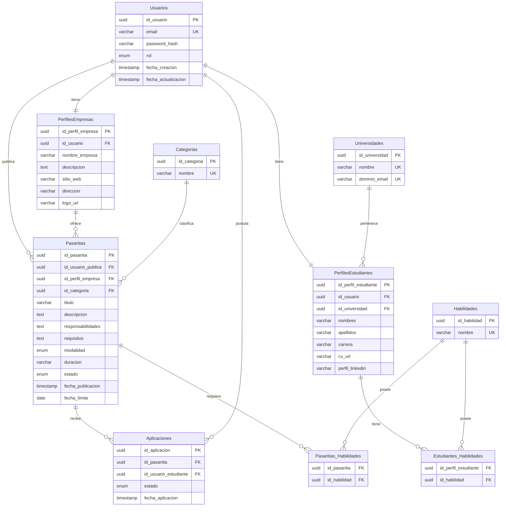
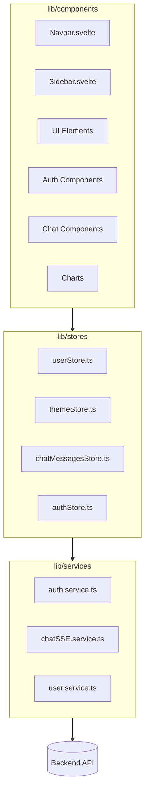
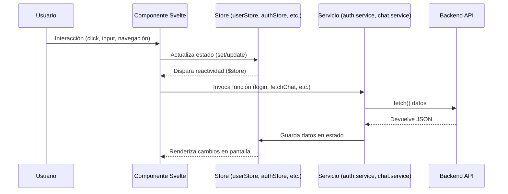
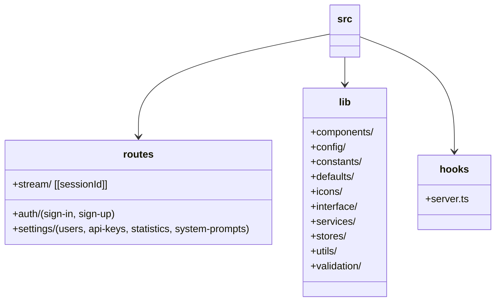

---

## 1. Estructura del Proyecto

```plaintext
📂 src
├── app.css / app.d.ts / app.html / hooks.server.ts / i18n.ts
├── lib/               # Librerías internas y componentes reutilizables
│   ├── components/    # Componentes UI (auth, chat, forms, skeletons, ui, etc.)
│   ├── config/        # Configuración (API, Firebase, permisos)
│   ├── constants/     # Constantes globales (app, navegación, etc.)
│   ├── defaults/      # Valores por defecto y JSONs iniciales
│   ├── icons/         # Íconos SVG en formato .svelte
│   ├── interface/     # Definición de interfaces TypeScript
│   ├── services/      # Lógica de negocio (auth, chat, items, etc.)
│   ├── stores/        # Estado global (Svelte stores)
│   ├── types/         # Tipos adicionales
│   ├── utils/         # Funciones auxiliares (UID, storage, fecha, zod, etc.)
│   └── validation/    # Validaciones centralizadas
├── routes/            # Rutas SvelteKit (+page.svelte, +layout.svelte, etc.)
│   ├── auth/          # Autenticación (sign-in, sign-up)
│   ├── settings/      # Configuración (usuarios, API keys, estadísticas, etc.)
│   ├── stream/        # Streaming (sessionId dinámico)
└── hooks/             # Hooks de servidor (autenticación, middlewares)
```

---

## 2. Diagrama de Componentes



---

## 3. Diagrama de Flujo de Datos



---

## 4. Diagrama de Arquitectura y Rutas


